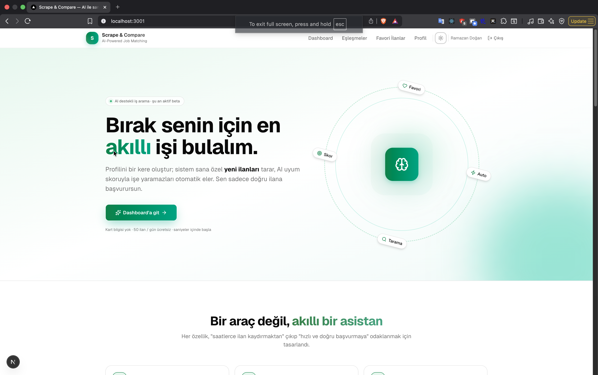
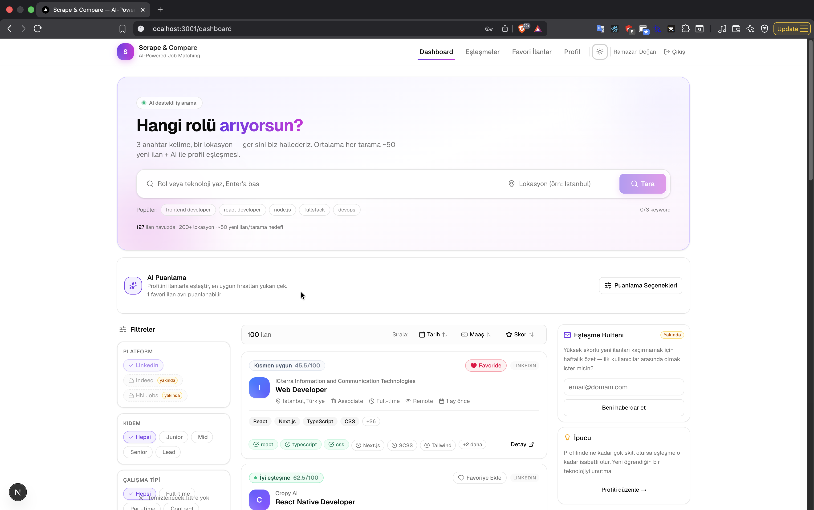

<div align="center">

# Scrape & Compare

**AI destekli iş ilanı tarayıcı + uyum skorlayıcı.**
LinkedIn'de saatlerce ilan kaydırmayı bırak — profilini bir kere oluştur, sistem 50+ yeni ilanı tarasın, AI uyum skoruyla işe yaramazları otomatik elesin.



[](https://nestjs.com/)
[](https://nextjs.org/)
[](https://www.typescriptlang.org/)
[](https://www.prisma.io/)
[](https://www.postgresql.org/)
[](https://redis.io/)
[](https://bullmq.io/)
[](https://playwright.dev/)
[](https://ai.google.dev/)
[](https://tailwindcss.com/)

</div>

> 🎥 **Tanıtım videosu:** Demo videosu boyutu nedeniyle (GitHub 100MB sınırı)
> repoya dahil edilmedi. Yakında harici bir bağlantı (YouTube/Loom) olarak eklenecek.

---

## 📚 İçindekiler

1. [Projeyi Bir Cümleyle Tarif Et](#projeyi-bir-cümleyle-tarif-et)
2. [Neden Bu Proje?](#neden-bu-proje)
3. [Ekran Görüntüleri](#ekran-görüntüleri)
4. [Mimari: Monorepo + Mikroservis Stil](#mimari-monorepo--mikroservis-stil)
5. [Backend — Tarama Stratejisi](#backend--tarama-stratejisi)
6. [AI Eşleştirme Motoru](#ai-eşleştirme-motoru)
7. [Kimlik Doğrulama](#kimlik-doğrulama)
8. [Frontend Deneyimi](#frontend-deneyimi)
9. [Tech Stack](#tech-stack)
10. [Hızlı Başlangıç](#hızlı-başlangıç)
11. [Proje Yapısı](#proje-yapısı)
12. [Yol Haritası](#yol-haritası)
13. [Yasal Uyarı](#yasal-uyarı)
14. [Lisans](#lisans)

---

## Projeyi Bir Cümleyle Tarif Et

**Profilini bir kere oluştur** — Scrape & Compare LinkedIn'den senin için 50+ yeni
ilan toplar, her birini Gemini ile **0–100 uyum skoru** verir, ve sadece doğru
ilana başvurman için yan menüye yerleştirir. Geri kalan zamanı kahve içersin.

## Neden Bu Proje?

> Klasik iş arama: 200 ilan kaydır, yarısı seviyene uymaz, çoğu zaten başvurduğun
> şirket, üstüne maaş bilgisi yok. Bir günün yandı.

Bu projeyi yaparken hedeflenen 3 şey:

- **Aşırı yükten kurtul.** Düşük kaliteli, alakasız ilanları kullanıcının önüne
  hiç çıkarma.
- **Karar süresini saniyelere indir.** Her ilana 0-100 uyum skoru ekle, kullanıcı
  sadece sayıya baksın.
- **Kendi kendine devam etsin.** Scrape biter bitmez puanlamayı otomatik kuyruğa
  at. İki tıklama yok, bir tıklama bile yok.

## Ekran Görüntüleri

<div align="center">

### Dashboard — Akıllı tarama + skorlanmış kartlar


### Eşleşmeler — 60+ skorlu ilanlar


### Profil — Dark mode + custom accent


</div>

---

## Mimari: Monorepo + Mikroservis Stil

Tek bir Docker host üzerinde **mikroservis-stil** sorumluluk ayrımı: backend
HTTP API, BullMQ worker'ları ve scraper aynı Node.js process'inde koşar ama
her biri **bağımsız bir modül** olarak yaşar. Şişer büyürse her birini ayrı
container'a taşımak 1 satırlık iş.

```
┌─────────────────────────────────────────────────────────────────┐
│                       Next.js 15 (Web)                          │
│       Landing · Dashboard · Matches · Favorites · Profile       │
└──────────────────────────┬──────────────────────────────────────┘
                           │  fetch() with httpOnly cookie
                           ▼
┌─────────────────────────────────────────────────────────────────┐
│                    NestJS Backend (single process)              │
│  ┌────────────┐  ┌────────────┐  ┌────────────┐  ┌────────────┐ │
│  │   Auth     │  │   Users    │  │   Jobs     │  │  Matcher   │ │
│  │  JWT+bcryp │  │  CRUD/me   │  │ List/Del   │  │  Trigger   │ │
│  └────────────┘  └────────────┘  └────────────┘  └─────┬──────┘ │
│  ┌────────────────────────────────────────────────────┐│        │
│  │             Scraper Module                         ││        │
│  │  controller → service → workers (BullMQ)           ││        │
│  │  ↓                                                 ││        │
│  │  Playwright + stealth + paginated scan             ││        │
│  └────────────────────────────────────────────────────┘│        │
│                                                        ▼        │
│  ┌─────────────────────────────────────────────────────────┐    │
│  │             BullMQ Workers (in same process)            │    │
│  │   • scraper queue  • matcher queue (batched, RPM-cap)   │    │
│  └─────────────────────────────────────────────────────────┘    │
└──────┬──────────────────────────────┬─────────────────┬─────────┘
       │                              │                 │
       ▼                              ▼                 ▼
┌─────────────┐              ┌─────────────────┐  ┌────────────┐
│ PostgreSQL  │              │      Redis      │  │  Gemini    │
│  (Prisma)   │              │ (BullMQ broker) │  │   (LLM)    │
└─────────────┘              └─────────────────┘  └────────────┘
```

### Neden bu yapı?

| Karar | Neden |
|---|---|
| **Monorepo (pnpm workspaces)** | `packages/shared` ile backend ↔ frontend tip + schema paylaşımı. Compile-time bağ. |
| **NestJS modüler** | Her domain ayrı module/service/controller. SRP zorunlu, test edilebilir. |
| **BullMQ + Redis** | Scrape ve AI puanlama uzun süreli işler — request-response'tan ayırıyoruz. HTTP 202 + polling. |
| **Prisma + PostgreSQL** | Raw SQL yasak. Type-safe query, migration version control'da. |
| **Discriminated Union'lar** | `ScrapeJobResult = Completed \| Failed` gibi — compile-time'da yanlış kullanım yakalanır. |
| **Zod runtime validation** | API sınırında her gelen veri + her LLM yanıtı doğrulanır. `any` yok. |

---

## Backend — Tarama Stratejisi

LinkedIn login'siz public search'ü scrape edilir. Bot tespiti karşısında 4
katmanlı savunma:

### 1. Playwright Stealth + Fingerprint
```ts
playwright-extra + puppeteer-extra-plugin-stealth
+ random viewport/user-agent rotation
```
WebGL, navigator.webdriver, Chrome runtime farklarını maskeler.

### 2. Resource Blocking
CSS/font/image/media istekleri engellenir → sayfa **~500ms**'de yüklenir.
Bot'tan çok "hızlı kullanıcı" gibi görünür.

### 3. Smart Pagination — "50 yeni ilan" hedefi
LinkedIn tek sayfada ~25 ilan döndürür. Önceki sürüm tek sayfa alıp
kesiyordu — kullanıcı 6 ilanla baş başa kalıyordu. Yeni davranış:

```
target: 50 yeni ilan per keyword
maxPages: 5 (LinkedIn'i zorlamamak için tavan)

while (collected < target && pageIndex < maxPages):
  fetchPage(start = pageIndex * 25)
  dedup with seenIds/seenLinks (cross-keyword)
  if blocked || exhausted: break
```

Sonuç kullanıcıya transparant raporlanır:
> *"50/50 ilan toplandı (3 sayfa)"* veya *"24/50 — LinkedIn bu keyword için
> yeterince yeni ilan yayımlamamış"*

### 4. Adaptive Backoff
Her hata `ScraperError` discriminated union'a sınıflandırılır
(`CLOUDFLARE_BLOCKED`, `CAPTCHA_DETECTED`, `TIMEOUT`, `RATE_LIMITED`...).
Her tip kendi base delay × exponential + jitter ile bekler. Üst üste %60+
hatalı batch olursa **8 saniye cooldown**.

### Parallel Tab Pool
Detay sayfaları **5 paralel tab** ile çekilir. 50 ilan için ortalama:
- Search faz: ~3-5 sn
- Detail faz: ~20-30 sn (paralel)
- Skill/salary extraction: ~1 sn
- **Toplam: ~30-60 sn / 50 ilan**

---

## AI Eşleştirme Motoru

### Gemini Batch Scoring + Fallback Chain

```
GEMINI_MODEL=gemini-2.5-flash               ← primary
GEMINI_FALLBACK_MODEL=gemini-2.5-flash-lite ← 503 overload fallback
QUOTA_FALLBACK=gemini-3.1-flash-lite         ← quota exceeded fallback
```

API capacity hatalarında zincir devreye girer — kullanıcı hiçbir hata görmez.

### Batch Pipeline
1. Frontend `/matcher/score` çağırır (`scope: 'unscored' | 'all' | 'selected'`)
2. Controller eski sonuçları siler, yeni job'ları **8'erli batch'lere** böler
3. Her batch BullMQ kuyruğuna eklenir (rate limit: 4 batch/dakika)
4. Worker her batch için **tek prompt** üretir — token tasarrufu
5. Sonuçlar Zod ile validate, `MatchResult` tablosuna upsert

### Scoring Formula (LLM tarafından uygulanır)
```
(Eşleşen Skiller / Gereken Skiller) × 0.6 + (Deneyim Uyumu) × 0.4
```
Sonuç: 0-100 skor + 1 cümle açıklama + eşleşen/eksik skill listesi.

### Otomatik Tetikleme
Scrape tamamlandığında dashboard `auditId`'yi `ScoringButton`'a sinyal olarak
geçer. Idle + unscored > 0 ise puanlama **tek tıklama olmadan başlar**.
Kullanıcı sadece sonucu görür.

---

## Kimlik Doğrulama

Tamamen production-grade auth katmanı:

| Endpoint | Açıklama |
|---|---|
| `POST /auth/signup` | bcrypt hash + JWT cookie + tek tıklama login |
| `POST /auth/login` | Email/password + timing-safe bcrypt karşılaştırma |
| `POST /auth/logout` | httpOnly cookie temizle |
| `POST /auth/forgot-password` | Token üret, 1 saat geçerli (dev modda response'da döner) |
| `POST /auth/reset-password` | Token doğrula + yeni hash + tek-kullanımlık |
| `GET /auth/me` | Cookie'den profil getir |

**Güvenlik kararları:**
- JWT 7 gün, `httpOnly + sameSite=lax + secure (prod)` cookie'de
- Global `AuthGuard` (NestJS `APP_GUARD`) — varsayılan deny, `@Public()` decorator ile opt-out
- `@CurrentUser()` decorator request.user'a tip-güvenli erişim
- Her endpoint'te **ownership check** — kullanıcı sadece kendi verisine erişebilir
- Email enumeration koruması — bilinmeyen email forgot/login'de aynı mesajı döner
- Timing-safe karşılaştırma — user yoksa bile bcrypt çağrılır
- bcrypt 10 round (~10ms, brute force için yeterli pratikte)

---

## Frontend Deneyimi

### Sayfalar
- **Landing** (`/`) — Hero + features + pricing + about + final CTA. Rotating
  headline, gradient figure, soft pulse animations.
- **Sign-in / Sign-up / Forgot / Reset** — Gradient brand panel + form. Hydration
  flash bug'ı bloklayıcı inline script ile çözüldü.
- **Dashboard** — Hero search + 3 sütunlu layout (filter sidebar + cards + right
  sidebar). Smart pagination raporu, skor badge'leri, favori kalbi.
- **Matches** — 60+ skorlu ilanlar, ortalama/top score istatistikleri.
- **Favorites** — Kullanıcının biriktirdiği ilanlar, sadece bunları yeniden
  puanlama seçeneği.
- **Profile** — Skill/role/location tag input, deneyim yılı.

### Tasarım Sistemi
- **2 brand accent**: violet (default) + emerald (toggle). CSS variables üzerinden
  tüm UI tek seferde swap olur.
- **Dark mode** + light mode, F5 flash'ı `<head>` inline script ile çözüldü.
- **Animasyonlar**: `animate-page-in`, `animate-card-in` + staggered delay (10×),
  `animate-soft-pulse`, `animate-float-cta`, `animate-blob` (background).
- **Skeleton loaders** — sayfa geçişlerinde boş durum flash'ı önlenir.

### State Yönetimi
- React Context: `AuthProvider` (status + user), `ThemeProvider` (mode + accent)
- Domain hooks: `useJobs`, `useMatchResults`, `useScraper`, `useScoring`,
  `useFavoriteJobs`, `useUser`
- Tüm fetch'lerde `credentials: 'include'` — auth cookie otomatik

---

## Tech Stack

### Backend
| Katman | Teknoloji |
|---|---|
| Runtime | Node.js 20+ |
| Framework | NestJS 11 (modular, DI, decorator-driven) |
| Database | PostgreSQL 15 + Prisma 6 |
| Queue | BullMQ + Redis |
| Scraping | Playwright + playwright-extra-plugin-stealth |
| AI | Google Gemini (2.5 Flash / Lite chain) |
| Auth | bcryptjs + jsonwebtoken + cookie-parser |
| Validation | Zod (API sınırı + LLM çıktı) |
| Logging | Pino (structured JSON, pino-pretty dev) |
| Testing | Vitest |

### Frontend
| Katman | Teknoloji |
|---|---|
| Framework | Next.js 15 (App Router, RSC) |
| Styling | Tailwind CSS 4 |
| UI | Shadcn/UI (Base UI primitives) |
| Icons | Lucide React |
| Toast | Sonner |
| Language | TypeScript 5.9 (strict) |

### DevOps
| Katman | Teknoloji |
|---|---|
| Monorepo | pnpm workspaces |
| Container | docker-compose (Postgres + Redis) |
| Process | Node `--watch` (dev), graceful shutdown hooks |

---

## Hızlı Başlangıç

### Gereksinimler
- Node.js 20+
- pnpm 9+
- Docker (Postgres + Redis için)

### Kurulum
```bash
# 1. Repo klonla
git clone https://github.com/ramazandogna/scrape-and-compare.git
cd scrape-and-compare

# 2. Bağımlılıklar
pnpm install

# 3. Altyapı (Postgres + Redis)
docker compose up -d

# 4. .env hazırla
cp .env.example .env
# JWT_SECRET'ı üret: openssl rand -hex 32 → .env'e koy
# GEMINI_API_KEY'i https://aistudio.google.com/app/apikey 'den al

# 5. Prisma
pnpm --filter @scrape/database generate
pnpm --filter @scrape/database migrate

# 6. Playwright browser
pnpm exec playwright install chromium

# 7. Çalıştır
pnpm dev:all
# → Backend: http://localhost:3000/api
# → Web:     http://localhost:3001
```

İlk açılışta `/sign-in`'e gider → kaydol → profili doldur → dashboard'da
keyword + location gir → Tara → tamamlandığında AI puanlama otomatik başlar.

---

## Proje Yapısı

```
scrape-and-compare/
├── apps/
│   ├── backend/                    # NestJS API + workers
│   │   ├── src/
│   │   │   ├── modules/
│   │   │   │   ├── auth/           # signup/login/forgot/reset
│   │   │   │   ├── users/          # profile CRUD
│   │   │   │   ├── jobs/           # job list + delete (owner)
│   │   │   │   ├── matcher/        # AI scoring queue + Gemini
│   │   │   │   └── scraper/        # Playwright + helpers/
│   │   │   ├── extractors/         # skill + salary parsing
│   │   │   ├── pipes/              # ZodValidationPipe
│   │   │   ├── filters/            # global exception filter
│   │   │   └── utils/              # logger, helpers
│   │   └── prisma.service.ts
│   └── web/                        # Next.js 15 frontend
│       └── src/
│           ├── app/                # route segments
│           ├── components/         # dashboard/, auth/, layout/, ...
│           ├── contexts/           # auth, theme
│           ├── hooks/              # useJobs, useScoring, ...
│           └── lib/                # api fetch wrapper, helpers
├── packages/
│   ├── database/                   # Prisma schema + migrations
│   └── shared/                     # Zod schemas + TS types
├── assets/                         # README screenshots + demo video
├── docker-compose.yml              # Postgres + Redis
└── pnpm-workspace.yaml
```

---

## Yol Haritası

### ✅ Tamamlanan
- Monorepo (pnpm workspaces) + paylaşılan tipler/schemalar
- Modüler NestJS backend (5 modül)
- LinkedIn scraper: stealth, paginated, adaptive backoff, resource blocking
- Gemini batch scoring + fallback chain + queue rate limit
- Auth: signup/login/logout/forgot/reset/me (JWT + httpOnly cookie)
- Frontend: 9 sayfa, dark mode + brand accent toggle
- DB: Prisma + 6 migration + ownership constraints
- E2E auth test suite (10 senaryo doğrulandı)

### 🚧 Sıradaki (deploy öncesi)
- **Mail servisi** (Resend / SES) — forgot password gerçek email gönderebilsin
- **Production deploy** (Vercel + Railway/Render)
- **Domain + SSL** (Cloudflare DNS)
- **Sentry** — error monitoring
- **GEMINI_API_KEY rotation** + secret manager

### 💡 Beta sonrası
- CV PDF parse + otomatik skill çıkarma
- Indeed, Glassdoor, HackerNews Jobs entegrasyonu
- Match feedback (👍/👎) → scoring prompt tuning
- Otomatik periyodik tarama (cron)
- Email digest — haftalık yüksek skorlu ilan özeti
- Premium tier: Stripe + Webhook + plan-based limits

---

## Yasal Uyarı

Bu proje **eğitim amaçlı kişisel bir araştırma çalışmasıdır**. LinkedIn'in
public search sonuçlarını scrape eder; herhangi bir hesaba giriş yapmaz veya
özel veriye erişmez.

Servisi kullanmadan önce hedef platformun **Terms of Service**'ini incelemek
ve uyumlu kullanmak **son kullanıcının sorumluluğundadır**. Proje sahipleri
ToS ihlallerinden sorumlu tutulamaz.

---

## Lisans

[MIT](./LICENSE) — özgürce klonla, fork'la, geliştir.

---

<div align="center">

**Bir geri bildirim ya da öneri için:** [doganrmzn40@gmail.com](mailto:doganrmzn40@gmail.com)

[GitHub](https://github.com/ramazandogna) · [LinkedIn](https://www.linkedin.com/in/ramazandogna/)

</div>
